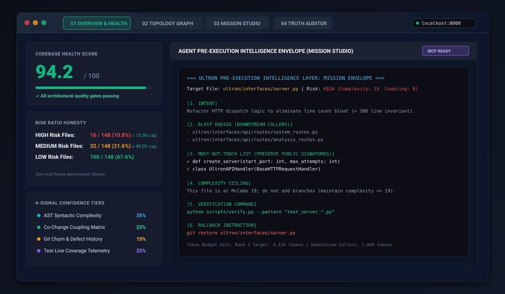

# 🚀 Ultron — Developer Onboarding & Visual Walkthrough Guide

Welcome to **Ultron**, the developer control plane and architectural safety engine for AI-assisted software engineering.

When directing autonomous coding agents (Cursor, Claude Code, Windsurf, Antigravity, Copilot), agents operate with local myopia: they edit functions without knowing caller fan-out, introduce circular dependency loops, and increase cyclomatic complexity. Ultron maps your codebase AST into an in-memory knowledge graph, computes caller blast radius, and compiles mathematically bounded context envelopes so agents make zero-regression edits.

This guide walks you step-by-step through a complete first session: from launching the control plane and running your first repository scan, to reading risk scores, inspecting the topology graph, compiling an agent mission package, and running automated CI gates.

---

## 📸 Architectural Overview

<p align="center">
  
</p>

The Ultron control plane is organized into **4 Interactive Pillars** accessible via top-level navigation tabs or hotkeys:
1. 📊 **Architecture Health Dashboard** (`Key: 1`): Calibrated 0–100 health score, primary risk verdict, and ranked file hotspots.
2. 🕸️ **Topology Graph** (`Key: 2`): Interactive SVG import-dependency graph with cycle detection and blast-radius tracing.
3. ⚡ **Agent Studio** (`Key: 3`): Mission compiler generating bounded pre-flight context envelopes for AI agents.
4. 🛡️ **Code Auditor** (`Key: 4`): Static safety gate checking syntax drift, naming anomalies, and architectural policy compliance.

---

## Step 1 — Install & Launch the Control Plane

Ultron is written in pure standard-library Python with zero external pip dependencies for its core runtime.

### 1.1 Clone and Install
```bash
git clone https://github.com/DMzinev/ultron.git
cd ultron
pip install -e .
```

> **Installation Latency**:
> A cold installation (`--no-cache-dir`) in a fresh environment completes in **~11 seconds**, reaching the first interactive screen in **~19.5 seconds**. Incremental installs take `< 2 seconds`.

### 1.2 Start the Server
Launch the local web dashboard using the console script:
```bash
ultron-server
```

By default, Ultron deterministically finds an open port (starting at `8000`), binds to the loopback interface (`127.0.0.1`), and outputs:
```text
[*] Ultron Dashboard Server running on http://127.0.0.1:8000/
[*] Ready. Navigate to the URL above in your browser.
```

**CLI Flags for `ultron-server`:**
- `--port <int>`: Initial port to bind (default: `8000`).
- `--host <ip>`: Host interface to bind (default: `127.0.0.1`).
- `--repo <path>`: Pre-load repository root directory (default: `.`).
- `--open`: Automatically open the browser on launch.
- `--no-browser`: Explicitly disable opening the browser.

Open [`http://127.0.0.1:8000/`](http://127.0.0.1:8000/) in your browser.

---

## Step 2 — Connect & Run Your First Scan

When you open Ultron for the first time, you are greeted by the clean landing state:

```text
+-------------------------------------------------------------------------------+
|  ◈ Ultron [Intelligence Layer]   [Architecture 1] [Topology 2] [Studio 3] ... |
|  [ Path to a repository...           ] [Browse]   [Scan repository]  (●) ready|
+-------------------------------------------------------------------------------+
|                                                                               |
|                   Know what's risky before you change it.                     |
|                                                                               |
|   Point Ultron at a Python repository. It ranks files by how likely a change  |
|   is to break something, and hands your coding agent a briefing it can act on.|
|                                                                               |
|                           [ Scan repository ]                                 |
|                                                                               |
+-------------------------------------------------------------------------------+
```

### 2.1 Select a Target Repository
You have three ways to target a repository:
1. **Default Target**: If you launched `ultron-server` from inside your repo, simply click the primary **"Scan repository"** button (`#empty-scan-btn` or `#scan-btn`).
2. **Text Input**: Type or paste the absolute or relative path into the repository input bar (`#repo-input`, e.g., `/home/user/my-project` or `C:\Projects\my-project`).
3. **Folder Picker**: Click **"Browse"** (`#browse-btn`) to open the in-browser directory browser (`#picker`), navigate your filesystem drives and folders, and click **"Use this folder"** (`#picker-use`).

### 2.2 Execute the Scan
Click **"Scan repository"** (`#scan-btn`) or press `Enter` in the `#repo-input` bar.

The UI transitions to the busy state (`#busy-state`):
- Animated spinner displays: *"Reading the repository…"*.
- Ultron traverses the directory, parses all source files with Python's native AST parser, extracts imports and call sites, calculates cyclomatic complexity, checks git commit churn, and loads test coverage data (if `coverage.xml` or `coverage.json` is present).
- For a 150-module repository, scanning finishes in **~0.25 to 0.40 seconds**.
- **Rescanning**: You can rescan at any time by clicking **"Scan repository"** (`#scan-btn`) or pressing `Enter` in `#repo-input`.

---

## Step 3 — Reading the Architecture Dashboard

Once analysis completes, the dashboard view (`#view-dashboard`) renders the primary verdict and repository health:

```text
+-------------------------------------------------------------------------------+
| PRIMARY VERDICT                                              HEALTH SCORE     |
| These 3 files are risky to change — here's why.              [ 84 /100 ]      |
| High branch complexity combined with caller fan-out...       Optimal          |
|                                                                               |
| [3 risky] [12 watch] [45 safe] [60 files] [2 violations] [0 cycles] [4 of 4]  |
+---------------------------------------+---------------------------------------+
| CHANGE WITH CARE        [/ to filter] | SELECT A FILE                         |
| 1. ultron/core/analyzer.py      HIGH  | Click any file on the left to inspect |
|    Complex control flow (McCabe 22)   | its complexity, caller fan-out, and   |
| 2. ultron/core/classifier.py    HIGH  | copy an AI agent mission package.     |
| 3. ultron/core/system_model.py  HIGH  |                                       |
| 4. ultron/interfaces/server.py  WATCH |                                       |
+---------------------------------------+---------------------------------------+
```

### 3.1 Primary Verdict Banner (`#primary-verdict-title`)
The top headline gives an instant, actionable architectural verdict:
- *"No files are risky to change right now — codebase is stable."* (when 0 high-risk files exist)
- *"This 1 file is risky to change — here's why."* (when 1 file is high risk)
- *"These N files are risky to change — here's why."* (for multiple high-risk files)

### 3.2 Metric Chips
Directly below the verdict, summary chips display key counts:
- **`#count-high` risky** (red): High-risk files exceeding complexity and caller fan-out thresholds.
- **`#count-med` watch** (yellow): Medium-risk files with moderate coupling or branching.
- **`#count-low` safe** (green): Modular leaf files safe to edit directly.
- **`#count-files` files**: Total number of analyzed modules.
- **`#count-violations` rule violations** (clickable chip `#violations-chip`): Opens the architectural policy drawer.
- **`#count-cycles` cycles**: Circular dependency loops detected in the import graph.
- **`#count-confidence`** (`#confidence-chip`): Provenance indicator showing active empirical signals (e.g., `4 of 4 signals` active: AST, Coupling, Git Churn, Test Coverage).

### 3.3 Composite Health Score (`#health-score`)
The health card computes a 0–100 score based on 3 pillars:
- **Cycle Stability (40%)**: Penalizes circular dependency loops.
- **Policy Compliance (40%)**: Penalizes architectural rule breaches.
- **Distribution Quality (20%)**: Evaluates risk distribution across modules.

**Status Badges (`#health-badge`):**
- **Optimal** (Score $\ge 75$): Healthy modular boundaries.
- **Watchlist** (Score $45$–$74$): Moderate coupling or emerging god modules.
- **Critical Risk** (Score $< 45$): Severe architectural degradation, tight coupling, or import cycles.

### 3.4 Ranked Hotspots List (`#risk-list`)
The left pane ranks files by impact score. Each item displays:
- **Rank number** (e.g., `1`, `2`, `3`).
- **File path** with directory prefix in subtle gray and filename bolded.
- **Primary reason badge** (`reasonsFor`): e.g., *"Complex control flow (McCabe 22)"*, *"Tightly coupled (score 8.5)"*, or *"14 files import it"*.
- **Severity tag**: `HIGH` (red), `MEDIUM`/`WATCH` (amber), or `LOW` (green).

**Search Filter (`#filter-input`)**: Press `/` to focus the search box and filter the risk list by file name in real time.

---

## Step 4 — Inspecting a Risky File & Violations

Clicking any row in the risk list opens the File Detail Pane (`.pane-detail`):

```text
+-------------------------------------------------------------------------------+
| ultron/core/analyzer.py               [🕸 Graph] [⚡ Studio] [🛡 Audit]        |
|                                       [Why (active)]  [Code]  [Agent brief]   |
|-------------------------------------------------------------------------------|
|  [ 8.2 ] Risk score   [ 22 ] Complexity   [ 6.0 ] Coupling   [ 14 ] Used by   |
|                                                                               |
|  Active Architectural Policy Violations (1)                                  |
|  • File Exceeds Complexity Ceiling (McCabe 22 > 15)                          |
|                                                                               |
|  Upstream Callers (14 files depend on this module):                           |
|  • ultron/interfaces/server.py                                                |
|  • ultron/interfaces/ultron.py                                                |
|  • ultron/core/risk/scoring.py                                                |
|                                                                               |
|  Change Strategy:                                                             |
|  Change this in small steps and re-run your tests after each one.             |
+-------------------------------------------------------------------------------+
```

### 4.1 The Inspection Tabs
- **Why Tab (`#tab-why`)**:
  - **Metrics Row**: Risk impact score, cyclomatic complexity (McCabe), coupling score, and dependent caller count (`Used by`).
  - **Active Policy Violations**: Lists specific architectural rules breached by this file.
  - **Upstream Callers**: Direct links to all files importing this module (blast radius).
  - **Change Strategy**: Prescriptive guidance for safely modifying the file.
- **Code Tab (`#tab-code`)**: Syntax-highlighted source code viewer with line numbers.
- **Agent Brief Tab (`#tab-brief`)**: Pre-formatted briefing with target selectors for **Claude**, **Codex**, **Antigravity**, or **Full brief**. Click **"Copy"** (`#copy-brief`) to copy directly.

### 4.2 Cross-Pillar Jump Actions (`#detail-actions`)
At the top-right of the detail pane, three quick-action buttons let you transition with the file pre-selected:
- **`🕸 Graph`** (`#btn-jump-graph`): Jumps to Pillar 2 and centers the node in the topology graph.
- **`⚡ Studio`** (`#btn-jump-studio`): Jumps to Pillar 3 with the file path populated in the Mission Compiler.
- **`🛡 Audit`** (`#btn-jump-auditor`): Jumps to Pillar 4 to run syntax drift and anomaly audits on the file.

### 4.3 Policy Violations Drawer (`#violations-drawer`)
Click the **"N rule violations"** chip (`#violations-chip`) in the verdict banner to slide open the Violations Drawer:
- Violations are grouped by architectural principle (e.g., *Layer Isolation*, *God Module Prevention*, *Cycle Freedom*).
- Items are ranked by **Severity $	imes$ Blast Radius** so you resolve the highest-impact structural risks first.
- Each violation includes observation details, consequences, and a **"Draft Fix Mission"** button that sends the violation directly to the Agent Studio.

---

## Step 5 — Exploring the Visual Topology Graph

Press `2` or click the **"Topology Graph"** tab in the top navigation bar to enter Pillar 2 (`#view-graph`):

```text
+-------------------------------------------------------------------------------+
| [Files | Symbols]  [All Modules] [Risky Only] [Core Files]  [Search node...]  |
| Showing 60 of 60 files                        [+] [-] [Reset]  ● Risky ● Safe |
+-------------------------------------------------------------------------------+
|                                                                               |
|            (ultron/interfaces/server.py)                                      |
|                       │                                                       |
|                       ▼                                                       |
|             (ultron/core/analyzer.py) ◄──────── (ultron/core/risk.py)        |
|                       │                                                       |
|                       ▼                                                       |
|             (ultron/core/models.py)                                           |
|                                                                               |
+-------------------------------------------------------------------------------+
```

### 5.1 Interactive Graph Canvas (`#topology-svg`)
- **Force-Directed Layout**: Visualizes package clusters and import relationships.
- **Package Color Coding**: Nodes in the same folder share consistent color hues.
- **Risk Border Coding**:
  - 🔴 **Red**: Risky files (`HIGH`).
  - 🟡 **Yellow**: Watchlist files (`MEDIUM`).
  - 🟢 **Green**: Safe leaf files (`LOW`).
  - 🟠 **Pulsing Orange**: Nodes participating in circular dependency cycles.
- **Pan and Zoom**: Drag canvas to pan; use mouse wheel or toolbar buttons (`#graph-zoom-in`, `#graph-zoom-out`, `#graph-zoom-reset`) to zoom.

### 5.2 Toolbar Controls
- **Granularity Toggle** (`#graph-granularity`): Switch between **Files** (module dependencies) and **Symbols** (class/function dependencies).
- **Filter Buttons**: Toggle between **All Modules**, **Risky Only** (isolates modules needing refactoring), and **Core Files**.
- **Search Node** (`#graph-search-input`): Type a module name to highlight and focus the node.

### 5.3 Node Inspector (`#graph-inspector`)
Clicking any node opens the floating Inspector card displaying:
- Module path, risk level, architectural role, and package.
- Direct metrics: Complexity, Coupling, and Impact score.
- Full upstream and downstream dependency list.
- Jump actions: **"Inspect in Dashboard"**, **"Draft Mission"**, or **"Audit File"**.

---

## Step 6 — Compiling a Bounded AI Agent Mission

Press `3` or click the **"Agent Studio"** tab (`#view-studio`) to use Pillar 3, the pre-flight mission compiler:

```text
+---------------------------------------+---------------------------------------+
| PRE-EXECUTION MISSION SPECIFICATION   | ULTRON PRE-EXECUTION CONTRACT         |
|                                       | 48 lines · ~312 tokens · Grounded AST |
| Target File or Boundary Module:       | [Copy Mission]   [Save .md]           |
| [ ultron/core/analyzer.py           ] |---------------------------------------|
|                                       | # ULTRON ZERO-REVISION CONTRACT       |
| User Intent & Feature Goals:          | TARGET: ultron/core/analyzer.py       |
| [ Refactor analyze_directory() to   ] | BLAST RADIUS: 14 callers              |
| [ reduce McCabe complexity from 22  ] | COMPLEXITY CEILING: <= 15             |
| [ to <= 15 without changing return  ] | FORBIDDEN MODIFICATIONS:              |
| [ signature.                        ] | - analyze_directory(path) return type |
|                                       | VERIFICATION COMMAND:                 |
| Agent Target & Output Format:         | python scripts/verify.py              |
| (•) Contract  ( ) Claude  ( ) Codex   |                                       |
|                                       |                                       |
| [ Compile Agent Mission Package ]     |                                       |
+---------------------------------------+---------------------------------------+
```

### 6.1 Configure the Mission Form
1. **Target File (`#studio-target-file`)**: Enter the module the agent will edit (e.g., `ultron/core/analyzer.py`). If you clicked `⚡ Studio` from the dashboard, this is pre-filled.
2. **User Intent (`#studio-intent`)**: Describe what the agent must do in natural language (e.g., *"Refactor analyze_directory to reduce branching complexity under 15 while keeping test coverage intact"*).
3. **Format Selector (`#studio-format-seg`)**:
   - **Ultron Contract**: Formal mathematical specification with blast radius, invariants, and complexity ceilings.
   - **Claude Code**: Tailored prompt syntax for the `claude` CLI.
   - **OpenAI Codex**: System markdown briefing formatted for ChatGPT / OpenAI models.
   - **Antigravity**: Structured architectural task envelope for Google Antigravity / Gemini agents.

### 6.2 Compile the Mission Package
Click **"Compile Agent Mission Package"** (`#studio-compile-btn`).

Within milliseconds, Ultron queries the AST knowledge graph and generates a bounded 7-field mission envelope in the output card (`#studio-output`):
1. **Target Boundary**: Absolute and relative module paths.
2. **Caller Blast Radius**: Exact list of files that import the target and could break.
3. **Public Interface Invariants**: Function signatures and exported symbols that must not be broken.
4. **Complexity Ceilings**: Maximum allowable McCabe cyclomatic score after the edit.
5. **Forbidden Actions**: Explicit constraints (e.g., do not introduce new external dependencies).
6. **Required Test Suite**: The exact test commands the agent must run to verify its work.
7. **Acceptance Criteria**: Concrete assertions for zero architectural regression.

### 6.3 Hand Off to Your Coding Agent
- Click **"Copy Mission"** (`#studio-copy-btn`) to copy the full prompt to your clipboard, then paste it directly into Cursor Composer, Claude Code, or Windsurf.
- Click **"Save .md"** (`#studio-download-btn`) to save `ultron-mission-<timestamp>.md` directly into your repository.

---

## Step 7 — Running the CI & Architecture Safety Gate

To guarantee that neither human developers nor autonomous AI agents merge code that degrades your architecture, Ultron provides two complementary verification tools.

### 7.1 Automated Test Verification: `scripts/verify.py`
The master test verification runner discovers and executes all unit, integration, and invariant tests across the entire codebase:

```bash
python scripts/verify.py
```

**Output:**
```text
Ran 812 tests in 184.321s

OK (skipped=9)
TESTS: 812 ran, 0 failed, 0 errors, 9 skipped
```
- **Exit Code `0`**: All tests pass.
- **Exit Code `1`**: Any test fails or errors.

### 7.2 Headless Architecture Quality Gate: `ultron gate`
While unit tests verify behavioral correctness, `ultron gate` enforces architectural invariants (preventing complexity sprawl, cycle formation, and health score degradation):

```bash
ultron gate --max-high 5 --min-health 70.0 --max-health-drop 3.0 --github-annotations
```

**Key CLI Flags:**
- `--max-high <int>`: Maximum allowed number of HIGH-risk files (exits 1 if exceeded).
- `--min-health <float>`: Minimum acceptable repository health score (0–100).
- `--max-health-drop <float>`: Maximum allowed health score drop compared to baseline (default: `5.0`).
- `--base <git-ref>`: Compare against a git ref (e.g., `--base origin/master`).
- `--baseline <path.json>`: Compare against a saved analysis JSON file.
- `--fail-on-high`: Exit 1 immediately if any HIGH-risk files or violations exist.
- `--strict`: Zero tolerance mode (0 health drop allowed, fails on any high-risk file).
- `--github-annotations`: Emit GitHub Actions workflow annotation commands (`::error file=...::`) directly into CI run logs for inline PR reviews.
- `--output-comment <file.md>`: Write a GitHub PR summary comment in markdown.

### 7.3 GitHub Actions Workflow Integration
Ultron includes a production-grade CI pipeline in `.github/workflows/ci.yml`. Here is how you wire both gates into your repository's CI workflow:

```yaml
name: Ultron Architecture & Quality Gate

on:
  push:
    branches: [ master, main ]
  pull_request:
    branches: [ master, main ]

jobs:
  validate-and-gate:
    name: Validate (${{ matrix.os }}, Python ${{ matrix.python-version }})
    runs-on: ${{ matrix.os }}
    strategy:
      matrix:
        os: [ ubuntu-latest, windows-latest ]
        python-version: [ '3.10', '3.11', '3.12' ]

    steps:
      - name: Checkout Codebase
        uses: actions/checkout@v4
        with:
          fetch-depth: 0

      - name: Set up Python
        uses: actions/setup-python@v5
        with:
          python-version: ${{ matrix.python-version }}

      - name: Install Dependencies
        run: |
          python -m pip install --upgrade pip
          python -m pip install -e .

      - name: Verify Master Test Suite
        run: python scripts/verify.py

      - name: Enforce Architecture Safety Gate
        run: |
          ultron gate --min-health 70.0 --max-health-drop 5.0 --github-annotations
```

When an agent's pull request violates an architectural threshold, `ultron gate` blocks the merge and posts inline file annotations pointing to the exact offending lines.

---

## Appendix A — Keyboard Shortcuts

Ultron features ergonomic keyboard navigation across all views:

| Shortcut | Action | Scope |
|:---:|:---|:---|
| `1` | Switch to **Architecture Health Dashboard** (`#view-dashboard`) | Global |
| `2` | Switch to **Visual Topology Graph** (`#view-graph`) | Global |
| `3` | Switch to **AI Agent Studio** (`#view-studio`) | Global |
| `4` | Switch to **Code Auditor** (`#view-auditor`) | Global |
| `/` | Focus search filter bar (`#filter-input`) | Dashboard |
| `Enter` | Submit path and trigger repository scan | In `#repo-input` |
| `Esc` | Dismiss active picker, drawer, inspector, or clear selection | Global |

---

## Appendix B — Live Code Auditor (Pillar 4)

Press `4` to enter Pillar 4, the **Code Auditor** (`#view-auditor`). This tool acts as an instantaneous pre-commit safety gate:

```text
+---------------------------------------+---------------------------------------+
| CODE SAFETY & QUALITY GATE            | SYSTEM SAFETY GATE                    |
| Audit Source:                         |                                       |
| (•) Repository File  ( ) Live Sandbox |            [ ✓ Safe ]                 |
|                                       | Code Safety Gate Passed               |
| Target File:                          | No typo drift, signature mismatches,  |
| [ ultron/core/analyzer.py           ] | or architectural violations found.    |
|                                       |                                       |
| Typo & Drift Sensitivity:             | Detected Anomalies & Signals (0):     |
| [====================|===] 75%        | All identifiers, signatures, and call |
|                                       | sequences comply with baseline rules. |
| [ Run Code Safety Audit ]             |                                       |
+---------------------------------------+---------------------------------------+
```

1. **Audit Source**:
   - **Repository File**: Inspect an existing file against codebase baselines.
   - **Live Code Sandbox**: Paste a draft code snippet before saving it to disk.
2. **Sensitivity Slider**: Adjust typo and identifier drift detection threshold ($10\%$–$95\%$).
3. **Execute Audit**: Click **"Run Code Safety Audit"** (`#auditor-run-btn`).
4. **Safety Shield (`#auditor-shield`)**:
   - `✓` **Safe** (green): Clean code passes all gates.
   - `!` **Alert** (amber): Identifier drift, syntax anomalies, or policy violations require inspection.
   - `✕` **Error** (red): Unparseable syntax or severe policy breach.

---

## Appendix C — Direct MCP Integration (Cursor / Claude / Windsurf)

If you use an editor with Model Context Protocol (MCP) support, you can connect your AI coding agent directly to Ultron over stdio:

### C.1 Configure Your MCP Client
Add the following to your MCP settings file (e.g., `.cursor/mcp.json` or `claude_desktop_config.json`):

```json
{
  "mcpServers": {
    "ultron": {
      "command": "ultron-mcp"
    }
  }
}
```

### C.2 Available Canonical MCP Tools
Once configured, your agent can call Ultron autonomously during editing:
- `get_risk_profile(file_path)`: Check risk score, complexity, and coupling.
- `get_blast_radius(file_path)`: Query all upstream dependent modules.
- `compile_mission(target_file, intent)`: Synthesize the 7-field bounded prompt envelope.
- `get_context_brief(target_file)`: Retrieve repository summary and architectural boundaries.
- `evaluate_repository()`: Query health score, violation counts, and cycle metrics.
- `audit_file(target_file)`: Scan for syntax drift and call anomalies.
- `explain_violation(violation_id)`: Get plain-English remediation instructions.
