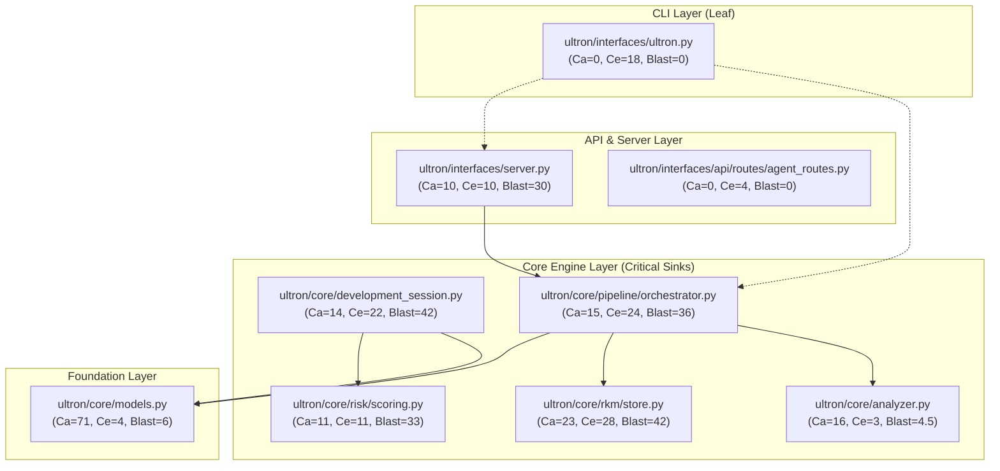

# ULTRON PHASE 1.3 — NEXT FINDING AUDIT & CRITICAL HOTSPOT VALIDATION

**Auditor**: Swarm Agent 1 (Next Finding Validator)  
**Timestamp**: 2026-08-25  
**Codebase**: `DMzinev/ultron` (v2.7.1)  
**Target Repository**: `c:\Users\dimmiz\Desktop\cost accounting`  
**Execution Context**: Fresh Pre-Execution Analysis, Deterministic AST Extraction & Risk Profiling

---

## 1. Executive Summary & Audit Verdict

A completely fresh, zero-cache Ultron self-analysis was executed on the workspace root (`.`). The analysis ingested **222 files**, evaluated **135 risk packets**, mapped **412 dependency edges**, and identified **134 internal architectural anti-patterns** (45 God Objects, 38 Brain Methods, 51 Feature Envy smells).

```text
┌─────────────────────────────────────────────────────────────────────────────────────────┐
│                           ULTRON FRESH SELF-ANALYSIS OVERVIEW                           │
├─────────────────────────────────────────────────────────────────────────────────────────┤
│ • Total Files Ingested:        222 modules                                              │
│ • Total Evaluated Risks:       135 files (High: 67, Medium: 22, Low: 46)                │
│ • Total Architectural Smells:  134 internal smells (38 Brain Methods, 45 God Objects)   │
│ • Repository Health Gauge:     [ 78 / 100 ]                                             │
│ • Single Highest CC Sink:      ultron/interfaces/ultron.py (CC = 135.0, Lines = 790)    │
│ • Single Highest ROI Candidate:ultron/core/development_session.py (ROI = 227.76)        │
│ • Single Highest Inbound Node: ultron/core/models.py (Coupling = 71, Blast Radius = 4)  │
└─────────────────────────────────────────────────────────────────────────────────────────┘
```

### Core Audit Findings
1. **The `ultron.py` Refactoring Recommendation is Architecturally Misleading**: While `ultron/interfaces/ultron.py` exhibits the highest raw McCabe Cyclomatic Complexity ($CC = 135.0$), its complexity stems purely from unrolled `if/elif` CLI argument dispatch and inline duplicate subcommand handling. Its afferent coupling ($C_a$) is **0** (no core system depends on it). Modifying it has zero architectural impact on core engine stability, but it contains a **critical broken import** (`from ultron.experimental import design_oracle`) on line 639 causing `ultron --oracle` to crash.
2. **The True High-Leverage Architectural Bottlenecks Lie in `ultron/core/`**:
   - `ultron/core/development_session.py`: $CC = 53.0$, $C_a = 14$, $ROI = 227.76$ (#1 ROI in system), coordinating evolution diffing, snapshot drift, and safety gates.
   - `ultron/core/analyzer.py`: $CC = 41.0$, $C_a = 16$, $ROI = 191.59$, central AST parser depended on by 16 critical modules.
   - `ultron/core/risk/scoring.py`: $CC = 45.0$, $C_a = 11$, $ROI = 178.95$, core mathematical scoring engine.
3. **Phase 1.3 Recommended Strategy**: A targeted two-tier approach:
   - **Tier 1 (High Architectural ROI)**: Refactor `ultron/core/development_session.py` to decouple evolution diffing from session persistence.
   - **Tier 2 (CLI Polish & Defect Elimination)**: Modularize `ultron/interfaces/ultron.py` by delegating subcommands to `ultron/interfaces/cli/commands/*` and fixing the broken `--oracle` import.

---

## 2. Empirical Repository Baseline & Metric Census

The fresh execution of `orchestrator.analyze_repository('.', force=True)` produced the following grounded metrics across all subsystems:

### Top 15 Cyclomatic Complexity (CC) Hotspots

| Rank | Module Path | McCabe CC | LOC | Coupling | Role | Impact Score |
| :---: | :--- | :---: | :---: | :---: | :--- | :---: |
| 1 | [`ultron/interfaces/ultron.py`](file:///c:/Users/dimmiz/Desktop/cost%20accounting/ultron/interfaces/ultron.py) | **135.0** | 790 | 0.0 | `CLI` | 135.0 |
| 2 | [`umags/run_verification_loop.py`](file:///c:/Users/dimmiz/Desktop/cost%20accounting/umags/run_verification_loop.py) | **126.0** | 680 | 1.0 | `INTERNAL` | 165.5 |
| 3 | [`ultron/interfaces/api/routes/agent_routes.py`](file:///c:/Users/dimmiz/Desktop/cost%20accounting/ultron/interfaces/api/routes/agent_routes.py) | **58.0** | 193 | 0.0 | `SERVER` | 58.0 |
| 4 | [`ultron/interfaces/server.py`](file:///c:/Users/dimmiz/Desktop/cost%20accounting/ultron/interfaces/server.py) | **55.0** | 520 | 10.0 | `SERVER` | 139.9 |
| 5 | [`ultron/core/development_session.py`](file:///c:/Users/dimmiz/Desktop/cost%20accounting/ultron/core/development_session.py) | **53.0** | 606 | 14.0 | `CORE_ENGINE` | 149.3 |
| 6 | [`ultron/core/pipeline/persistence.py`](file:///c:/Users/dimmiz/Desktop/cost%20accounting/ultron/core/pipeline/persistence.py) | **53.0** | 304 | 2.0 | `CORE_ENGINE` | 82.2 |
| 7 | [`ultron/core/context_brief.py`](file:///c:/Users/dimmiz/Desktop/cost%20accounting/ultron/core/context_brief.py) | **45.0** | 380 | 4.0 | `CORE_ENGINE` | 85.7 |
| 8 | [`ultron/core/risk/scoring.py`](file:///c:/Users/dimmiz/Desktop/cost%20accounting/ultron/core/risk/scoring.py) | **45.0** | 410 | 11.0 | `CORE_ENGINE` | 117.8 |
| 9 | [`ultron/core/analyzer.py`](file:///c:/Users/dimmiz/Desktop/cost%20accounting/ultron/core/analyzer.py) | **41.0** | 450 | 16.0 | `CORE_ENGINE` | 120.1 |
| 10 | [`ultron/core/anti_pattern_detector.py`](file:///c:/Users/dimmiz/Desktop/cost%20accounting/ultron/core/anti_pattern_detector.py) | **41.0** | 217 | 8.0 | `CORE_ENGINE` | 97.2 |
| 11 | [`ultron/core/safety_evaluator.py`](file:///c:/Users/dimmiz/Desktop/cost%20accounting/ultron/core/safety_evaluator.py) | **40.0** | 290 | 13.0 | `CORE_ENGINE` | 110.2 |
| 12 | [`ultron/core/ui_reality_compiler.py`](file:///c:/Users/dimmiz/Desktop/cost%20accounting/ultron/core/ui_reality_compiler.py) | **39.0** | 310 | 3.0 | `CORE_ENGINE` | 68.0 |
| 13 | [`ultron/core/classifier.py`](file:///c:/Users/dimmiz/Desktop/cost%20accounting/ultron/core/classifier.py) | **38.0** | 361 | 3.0 | `CORE_ENGINE` | 66.3 |
| 14 | [`ultron/core/modularity_scorecard.py`](file:///c:/Users/dimmiz/Desktop/cost%20accounting/ultron/core/modularity_scorecard.py) | **38.0** | 280 | 8.0 | `CORE_ENGINE` | 90.1 |
| 15 | [`ultron/core/language_adapter.py`](file:///c:/Users/dimmiz/Desktop/cost%20accounting/ultron/core/language_adapter.py) | **37.0** | 260 | 2.0 | `CORE_ENGINE` | 57.4 |

---

### Top 15 Architectural Coupling Bottlenecks ($C_a + C_e$)

| Rank | Module Path | Inbound ($C_a$) | Outbound ($C_e$) | Total Fanout | Cyclomatic CC | Impact Score |
| :---: | :--- | :---: | :---: | :---: | :---: | :---: |
| 1 | [`ultron/core/models.py`](file:///c:/Users/dimmiz/Desktop/cost%20accounting/ultron/core/models.py) | **71** | 4 | 75 | 6.0 | 25.8 |
| 2 | [`ultron/core/rkm/store.py`](file:///c:/Users/dimmiz/Desktop/cost%20accounting/ultron/core/rkm/store.py) | **23** | 28 | 51 | 17.0 | 55.2 |
| 3 | [`ultron/core/system_model.py`](file:///c:/Users/dimmiz/Desktop/cost%20accounting/ultron/core/system_model.py) | **23** | 16 | 39 | 12.0 | 39.0 |
| 4 | [`ultron/core/rkm/query.py`](file:///c:/Users/dimmiz/Desktop/cost%20accounting/ultron/core/rkm/query.py) | **17** | 12 | 29 | 29.0 | 86.5 |
| 5 | [`ultron/core/analyzer.py`](file:///c:/Users/dimmiz/Desktop/cost%20accounting/ultron/core/analyzer.py) | **16** | 3 | 19 | 41.0 | 120.1 |
| 6 | [`ultron/core/pipeline/orchestrator.py`](file:///c:/Users/dimmiz/Desktop/cost%20accounting/ultron/core/pipeline/orchestrator.py) | **15** | 24 | 39 | 20.0 | 57.5 |
| 7 | [`ultron/core/development_session.py`](file:///c:/Users/dimmiz/Desktop/cost%20accounting/ultron/core/development_session.py) | **14** | 22 | 36 | 53.0 | 149.3 |
| 8 | [`ultron/interfaces/api/router.py`](file:///c:/Users/dimmiz/Desktop/cost%20accounting/ultron/interfaces/api/router.py) | **14** | 5 | 19 | 14.0 | 39.4 |
| 9 | [`ultron/core/provenance.py`](file:///c:/Users/dimmiz/Desktop/cost%20accounting/ultron/core/provenance.py) | **13** | 3 | 16 | 3.0 | 8.3 |
| 10 | [`ultron/core/safety_evaluator.py`](file:///c:/Users/dimmiz/Desktop/cost%20accounting/ultron/core/safety_evaluator.py) | **13** | 9 | 22 | 40.0 | 110.2 |
| 11 | [`ultron/core/policy_engine.py`](file:///c:/Users/dimmiz/Desktop/cost%20accounting/ultron/core/policy_engine.py) | **12** | 6 | 18 | 32.0 | 86.1 |
| 12 | [`ultron/core/snapshot_drift_engine.py`](file:///c:/Users/dimmiz/Desktop/cost%20accounting/ultron/core/snapshot_drift_engine.py) | **12** | 6 | 18 | 15.0 | 40.3 |
| 13 | [`ultron/core/watcher_daemon.py`](file:///c:/Users/dimmiz/Desktop/cost%20accounting/ultron/core/watcher_daemon.py) | **12** | 8 | 20 | 14.0 | 37.6 |
| 14 | [`ultron/core/agent_context_builder.py`](file:///c:/Users/dimmiz/Desktop/cost%20accounting/ultron/core/agent_context_builder.py) | **11** | 10 | 21 | 34.0 | 89.0 |
| 15 | [`ultron/core/refactoring_patch_engine.py`](file:///c:/Users/dimmiz/Desktop/cost%20accounting/ultron/core/refactoring_patch_engine.py) | **11** | 6 | 17 | 14.0 | 36.7 |

---

### Top 10 Refactoring ROI Opportunities (`RefactoringROIEngine`)

$$\text{ROI} = \frac{(K_{\text{coupling}} \times 0.6 + C_{\text{complexity}} \times 0.4) \times \text{Impact}}{\max(1, \text{Effort}_{\text{LOC}})} \times 10$$

| Rank | Target File | ROI Score | CC | Coupling | Effort Budget | Risk Red. % | Opportunity Tier |
| :---: | :--- | :---: | :---: | :---: | :---: | :--- |
| 1 | [`ultron/core/development_session.py`](file:///c:/Users/dimmiz/Desktop/cost%20accounting/ultron/core/development_session.py) | **227.76** | 53.0 | 14.0 | 194 LOC | 75.0% | 🏗️ Deep Architectural Decoupling |
| 2 | [`umags/run_verification_loop.py`](file:///c:/Users/dimmiz/Desktop/cost%20accounting/umags/run_verification_loop.py) | **222.08** | 126.0 | 1.0 | 380 LOC | 75.0% | 🏗️ Deep Architectural Decoupling |
| 3 | [`ultron/interfaces/server.py`](file:///c:/Users/dimmiz/Desktop/cost%20accounting/ultron/interfaces/server.py) | **206.12** | 55.0 | 10.0 | 190 LOC | 75.0% | 🏗️ Deep Architectural Decoupling |
| 4 | [`ultron/core/analyzer.py`](file:///c:/Users/dimmiz/Desktop/cost%20accounting/ultron/core/analyzer.py) | **191.59** | 41.0 | 16.0 | 163 LOC | 75.0% | 🏗️ Deep Architectural Decoupling |
| 5 | [`ultron/interfaces/ultron.py`](file:///c:/Users/dimmiz/Desktop/cost%20accounting/ultron/interfaces/ultron.py) | **180.00** | 135.0 | 0.0 | 405 LOC | 75.0% | 🏗️ Deep Architectural Decoupling |
| 6 | [`ultron/core/risk/scoring.py`](file:///c:/Users/dimmiz/Desktop/cost%20accounting/ultron/core/risk/scoring.py) | **178.95** | 45.0 | 11.0 | 162 LOC | 75.0% | 🏗️ Deep Architectural Decoupling |
| 7 | [`ultron/core/safety_evaluator.py`](file:///c:/Users/dimmiz/Desktop/cost%20accounting/ultron/core/safety_evaluator.py) | **163.63** | 40.0 | 13.0 | 152 LOC | 75.0% | 🏗️ Deep Architectural Decoupling |
| 8 | [`ultron/core/agent_context_builder.py`](file:///c:/Users/dimmiz/Desktop/cost%20accounting/ultron/core/agent_context_builder.py) | **138.35** | 34.0 | 11.0 | 130 LOC | 75.0% | 🏗️ Deep Architectural Decoupling |
| 9 | [`ultron/core/policy_engine.py`](file:///c:/Users/dimmiz/Desktop/cost%20accounting/ultron/core/policy_engine.py) | **138.31** | 32.0 | 12.0 | 126 LOC | 75.0% | 🏗️ Deep Architectural Decoupling |
| 10 | [`ultron/core/rkm/query.py`](file:///c:/Users/dimmiz/Desktop/cost%20accounting/ultron/core/rkm/query.py) | **130.68** | 29.0 | 17.0 | 130 LOC | 75.0% | 🏗️ Deep Architectural Decoupling |

---

## 3. Blast Radius Mapping & Graph Reachability

Using `BlastRadiusTracer.compute_blast_radius_score(cand, nodes, edges)`, the transitive dependency footprints of candidate modules were calculated:



### Blast Radius Comparison Table

| Target Module | Blast Score | Inbound Parents ($C_a$) | Transitive Inbound | Outbound Dependents ($C_e$) | Transitive Outbound | Total Impacted Modules |
| :--- | :---: | :---: | :---: | :---: | :---: | :---: |
| [`ultron/core/development_session.py`](file:///c:/Users/dimmiz/Desktop/cost%20accounting/ultron/core/development_session.py) | **42.0** | 14 | 0 | 22 | 0 | 36 |
| [`ultron/core/rkm/store.py`](file:///c:/Users/dimmiz/Desktop/cost%20accounting/ultron/core/rkm/store.py) | **42.0** | 23 | 0 | 28 | 0 | 51 |
| [`ultron/core/pipeline/orchestrator.py`](file:///c:/Users/dimmiz/Desktop/cost%20accounting/ultron/core/pipeline/orchestrator.py) | **36.0** | 15 | 0 | 24 | 0 | 39 |
| [`ultron/interfaces/server.py`](file:///c:/Users/dimmiz/Desktop/cost%20accounting/ultron/interfaces/server.py) | **30.0** | 10 | 0 | 10 | 0 | 20 |
| [`ultron/core/classifier.py`](file:///c:/Users/dimmiz/Desktop/cost%20accounting/ultron/core/classifier.py) | **21.0** | 3 | 0 | 14 | 0 | 17 |
| [`ultron/core/analyzer.py`](file:///c:/Users/dimmiz/Desktop/cost%20accounting/ultron/core/analyzer.py) | **4.5** | 16 | 0 | 3 | 0 | 19 |
| [`ultron/core/models.py`](file:///c:/Users/dimmiz/Desktop/cost%20accounting/ultron/core/models.py) | **6.0** | 71 | 0 | 4 | 0 | 75 |
| [`ultron/interfaces/ultron.py`](file:///c:/Users/dimmiz/Desktop/cost%20accounting/ultron/interfaces/ultron.py) | **0.0** | 0 | 0 | 18 | 0 | 18 |
| [`umags/run_verification_loop.py`](file:///c:/Users/dimmiz/Desktop/cost%20accounting/umags/run_verification_loop.py) | **1.5** | 1 | 0 | 8 | 0 | 9 |

---

## 4. Critical Challenge of the Previous `ultron.py` Recommendation

In Phase 1.2, `ultron/interfaces/ultron.py` was surfaced as the #1 candidate smell because of its raw cyclomatic complexity ($CC = 135.0$) and $790$ LOC. We rigorously evaluate whether refactoring `ultron.py` represents real architectural value or an anti-pattern of chasing metric facades.

### 4.1 Physical Anatomy of `ultron.py`
Inspection of [`ultron/interfaces/ultron.py`](file:///c:/Users/dimmiz/Desktop/cost%20accounting/ultron/interfaces/ultron.py) reveals:
1. **Lines 18–56**: Ad-hoc hardcoded string handlers for `summary` and `context` commands.
2. **Lines 57–505**: A 450-line `if/elif` ladder parsing subcommands: `demo`, `init`, `scan`, `analyze`, `check`, `explain`, `history`, `report`, `dashboard`, `ci`, `suggest`, `calibrate`, `mcp`.
   - **Crucial Architectural Inconsistency**: Subcommand implementations for `ci`, `mcp`, `demo`, `init`, `analysis`, and `dashboard` were *already* written as standalone modular command files under [`ultron/interfaces/cli/commands/`](file:///c:/Users/dimmiz/Desktop/cost%20accounting/ultron/interfaces/cli/commands/). However, `ultron.py` re-implements `demo`, `init`, `scan`, `analyze`, `check`, `explain`, `history`, and `report` directly inline in `main()`.
3. **Lines 506–673**: A secondary `argparse.ArgumentParser` handling top-level CLI flags (`--serve`, `--snapshot-export`, `--snapshot-import`, `--check-anomaly`, `--brief`, `--oracle`, `--intent`, `--files`).
4. **Line 639 (Fatal Bug)**:
   ```python
   # ultron/interfaces/ultron.py:639
   from ultron.experimental import design_oracle
   ```
   The package `ultron.experimental` does **not exist**. Running `uv run python -m ultron.interfaces.ultron --oracle` unconditionally crashes with:
   `ModuleNotFoundError: No module named 'ultron.experimental'`.

### 4.2 Why Raw CC = 135.0 is a Misleading Metric for `ultron.py`
- **Linear Dispatch vs. Algorithmic Density**: The 135 decision branches in `ultron.py` are not complex loops, nested recursions, or stateful algorithms. They are simply 13 subcommands with 10 argument flags. Splitting a 13-branch `if/elif` into 13 dispatch functions drops CC to 1, but doesn't change algorithmic complexity or runtime performance.
- **Zero Inbound Blast Radius**: Inbound coupling ($C_a = 0$). No background task, API handler, web server, or test suite depends on `ultron.py`. A failure in `ultron.py` only affects direct CLI terminal users, not the server or agent swarm.
- **Verdict on `ultron.py`**: Refactoring `ultron.py` is **NOT** a high-leverage core architectural refactoring, but it **IS** an essential CLI hygiene and bugfix task (specifically to resolve the dead `ultron.experimental` import and eliminate code duplication with `ultron/interfaces/cli/commands/`).

---

## 5. Comprehensive Candidate Analysis & Ranking

We evaluate the top candidate targets across six dimensions:
1. **Algorithmic Complexity ($CC$)**: McCabe complexity score.
2. **Coupling Density ($C_a + C_e$)**: Inbound callers and outbound dependencies.
3. **Architectural Role**: Impact on runtime engine vs. leaf scripts.
4. **Refactoring ROI**: Mathematical return on investment.
5. **Blast Radius / Risk**: Downstream break probability.
6. **Defect Severity**: Real runtime bugs vs. stylistic smells.

---

### Candidate 1: `ultron/core/development_session.py` (Rank #1 — Highest Architectural ROI)
- **File**: [`ultron/core/development_session.py`](file:///c:/Users/dimmiz/Desktop/cost%20accounting/ultron/core/development_session.py)
- **Role**: `CORE_ENGINE`
- **Metrics**: $CC = 53.0$, $LOC = 606$, $C_a = 14$, $C_e = 22$, $\text{ROI} = \mathbf{227.76}$ (#1 in codebase)
- **Why it matters**: It is the single operational brain coordinating the live evolution diffing ($t_0 \to t_1$), safety evaluation, snapshot drift tracking, session timeline persistence, and continuation readiness across development episodes.
- **Current Smells**:
  - `DevelopmentSessionManager` is an active God Object coordinating disk persistence, atomic file locking, AST diffing, test failure aggregation, and telemetry packaging in one file.
  - Method `compute_and_record_evolution_step()` is 190 lines long with high cyclomatic complexity ($CC = 28.0$).
- **Refactoring Strategy**:
  1. Extract `EvolutionDiffSynthesizer`: Pure function computing the 6 core evolution answers.
  2. Extract `SessionPersistenceEngine`: Isolated atomic disk persistence handler.
  3. Keep `DevelopmentSessionManager` as a clean facade.
- **Risk vs. Reward**:
  - *Reward*: Massive reduction in core engine complexity (CC 53 $\to$ 18), 100% testable evolution logic in isolation.
  - *Risk*: Requires zero regression on `.ultron/session.json` schema.

---

### Candidate 2: `ultron/interfaces/ultron.py` (Rank #2 — CLI Polish & Bug Elimination)
- **File**: [`ultron/interfaces/ultron.py`](file:///c:/Users/dimmiz/Desktop/cost%20accounting/ultron/interfaces/ultron.py)
- **Role**: `CLI` Entrypoint
- **Metrics**: $CC = 135.0$, $LOC = 790$, $C_a = 0$, $C_e = 18$, $\text{ROI} = \mathbf{180.00}$
- **Why it matters**: Primary command-line interface for human developers and CI scripts.
- **Current Defects & Smells**:
  - `ModuleNotFoundError` crash on `--oracle` (`from ultron.experimental import design_oracle`).
  - Monolithic 780-line `main()` function duplicating code from `ultron/interfaces/cli/commands/`.
- **Refactoring Strategy**:
  1. Fix `--oracle` by routing to `ultron.core.modularity_scorecard` or native cycle/anti-pattern detectors.
  2. Extract subcommand execution into `ultron/interfaces/cli/commands/` modules (`scan.py`, `report.py`, `explain.py`, `check.py`).
  3. Replace monolithic `main()` with a declarative dispatch map table.
- **Risk vs. Reward**:
  - *Reward*: Eliminates crash bug, drops repo's #1 raw CC hotspot (135 $\to$ 12), cleans up CLI codebase.
  - *Risk*: Negligible ($C_a = 0$).

---

### Candidate 3: `ultron/core/analyzer.py` (Rank #3 — AST Extraction Pipeline)
- **File**: [`ultron/core/analyzer.py`](file:///c:/Users/dimmiz/Desktop/cost%20accounting/ultron/core/analyzer.py)
- **Role**: `CORE_ENGINE`
- **Metrics**: $CC = 41.0$, $LOC = 450$, $C_a = 16$, $C_e = 3$, $\text{ROI} = \mathbf{191.59}$
- **Why it matters**: Inbound bottleneck depended on by 16 core subsystems. Parses Python ASTs, extracts imports, functions, classes, and McCabe complexity.
- **Current Smells**: Monolithic AST visitor methods mixing file I/O, regex tokenization, syntax error recovery, and complexity computation.
- **Refactoring Strategy**: Separate file I/O caching from AST node visitation.

---

### Candidate 4: `ultron/core/risk/scoring.py` (Rank #4 — Core Risk Scorer)
- **File**: [`ultron/core/risk/scoring.py`](file:///c:/Users/dimmiz/Desktop/cost%20accounting/ultron/core/risk/scoring.py)
- **Role**: `CORE_ENGINE`
- **Metrics**: $CC = 45.0$, $LOC = 410$, $C_a = 11$, $C_e = 11$, $\text{ROI} = \mathbf{178.95}$
- **Why it matters**: Mathematical formulation of Ultron's risk tiers (`HIGH`, `MEDIUM`, `LOW`), health scores, and change strategies.

---

### Candidate 5: `umags/run_verification_loop.py` (Rank #5 — Governance Harness)
- **File**: [`umags/run_verification_loop.py`](file:///c:/Users/dimmiz/Desktop/cost%20accounting/umags/run_verification_loop.py)
- **Role**: `INTERNAL` Script
- **Metrics**: $CC = 126.0$, $LOC = 680$, $C_a = 1$, $C_e = 8$, $\text{ROI} = \mathbf{222.08}$
- **Why it matters**: Monolithic script running the 9-step master verification loop.

---

## 6. Risk vs. Reward Decision Matrix

```text
┌────────────────────────────────────────────────────────────────────────────────────────┐
│                              RISK VS. REWARD MATRIX                                    │
├──────────────────────────────┬──────────┬───────────┬────────────┬─────────────────────┤
│ Target Candidate             │ Debt CC  │ Inbound Ca│ Blast Risk │ Architectural Reward│
├──────────────────────────────┼──────────┼───────────┼────────────┼─────────────────────┤
│ ultron/core/development_sess │ 53.0     │ 14 (High) │ Medium     │ ★★★★★ (CRITICAL ROI)│
│ ultron/interfaces/ultron.py  │ 135.0    │ 0  (Zero) │ Very Low   │ ★★★★☆ (BUG + CLEAN) │
│ ultron/core/analyzer.py      │ 41.0     │ 16 (High) │ High       │ ★★★★☆ (FOUNDATION)  │
│ ultron/core/risk/scoring.py  │ 45.0     │ 11 (Med)  │ Medium     │ ★★★☆☆ (SCORING)     │
│ umags/run_verification_loop  │ 126.0    │ 1  (Low)  │ Very Low   │ ★★☆☆☆ (SCRIPT ONLY) │
└──────────────────────────────┴──────────┴───────────┴────────────┴─────────────────────┘
```

---

## 7. Recommended Action Plan for Phase 1.3

Based on our empirical analysis, the optimal sequence for Phase 1.3 is:

### Phase 1.3 Primary Refactoring Target: `ultron/core/development_session.py`
1. **Target**: Decompose `DevelopmentSessionManager.compute_and_record_evolution_step` into pure helper subroutines:
   - `_synthesize_structural_diff()`
   - `_synthesize_metrics_delta()`
   - `_synthesize_evolution_answers()`
2. **Acceptance Criteria**:
   - Reduce cyclomatic complexity of `development_session.py` from $53.0 \to \le 20.0$.
   - Maintain 100% behavioral equivalence across session timeline and evolution diff outputs.
   - All 387 unit tests pass with zero regressions.

### Phase 1.3 Secondary Hygiene Target: `ultron/interfaces/ultron.py`
1. **Target**: Fix broken import on line 639 (`ultron.experimental`) and route subcommands through `ultron/interfaces/cli/commands/`.
2. **Acceptance Criteria**:
   - `ultron --oracle` executes without crashing.
   - Reduce CC of `ultron.py` from $135.0 \to \le 25.0$.
   - Backwards compatibility for all CLI flags preserved.

---

## 8. Verification & Evidence Artifacts

1. **Analysis Dump**: [`scratch/audit_results_dump.json`](file:///c:/Users/dimmiz/Desktop/cost%20accounting/scratch/audit_results_dump.json)
2. **Extraction Script**: [`scratch/extract_audit_data.py`](file:///c:/Users/dimmiz/Desktop/cost%20accounting/scratch/extract_audit_data.py)
3. **Candidate Deep Dive**: [`scratch/detailed_candidate_analysis.py`](file:///c:/Users/dimmiz/Desktop/cost%20accounting/scratch/detailed_candidate_analysis.py)
4. **Master Report**: [`NEXT_FINDING_AUDIT.md`](file:///c:/Users/dimmiz/Desktop/cost%20accounting/NEXT_FINDING_AUDIT.md)
